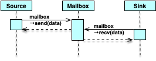

# tricky_communications
## Description

This repository contains examples used in Doulos' Tricky Communications with C/C++ Webinar. Please contact <info@doulos.com> for more information on the webinar.

The focus of the webinar was to illustrate the issues with creating a simple one-way mailbox used by two processors to communicate. The following sequence diagram illustrates the protocol. A simple flag indicates when the mailbox is full and available  for reading or empty and available for writing.




The following are flow charts of the send and receive methods.


This can be implemented with the following headers. For C:

```c
#ifndef MAILBOX_H
#define MAILBOX_H
#include <stdint.h>
#include <stdbool.h>

void mailbox_send( uint64_t data );
void mailbox_recv( uint64_t *data );

#endif /*MAILBOX_H*/
```

For C++:

```c++
#ifndef MAILBOX_HPP
#define MAILBOX_HPP
// Requires C++11 or better
#include <cstdint>

struct Mailbox {

  Mailbox( void ) = default;
  Mailbox( const Mailbox& ) = delete;
  void send( uint64_t data );
  void recv( uint64_t& data );

private:
  struct pImpl;
  pImpl* m;
};

#endif /*MAILBOX_HPP*/
```

## How to build

This project runs under **cmake**.

#### The end
